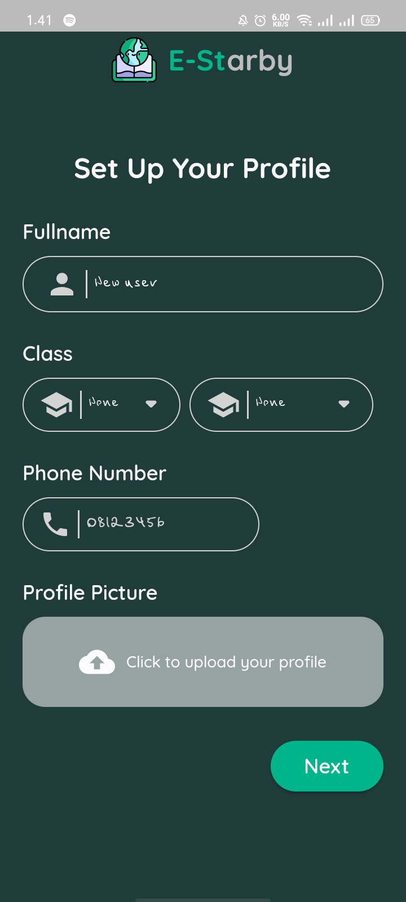
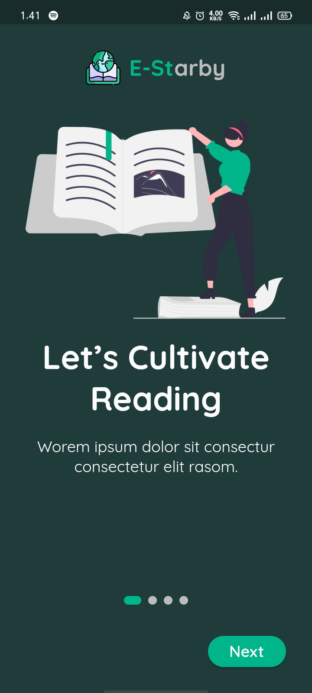
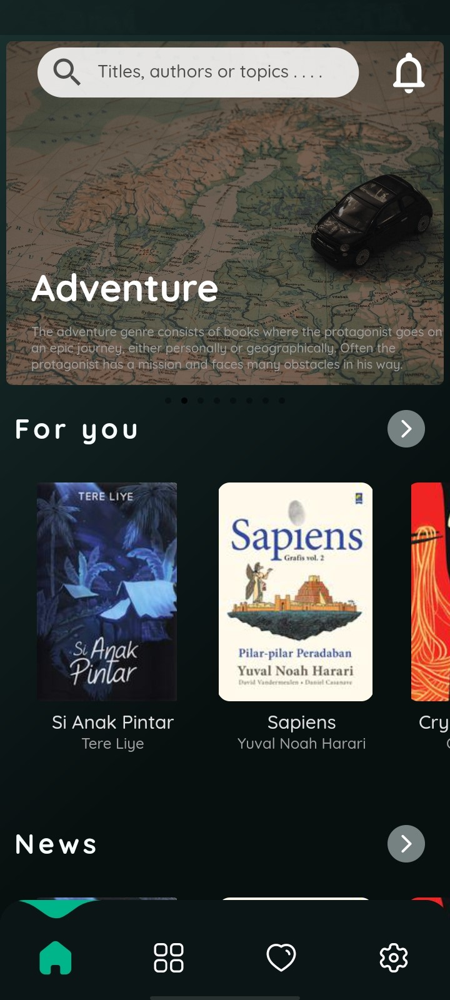
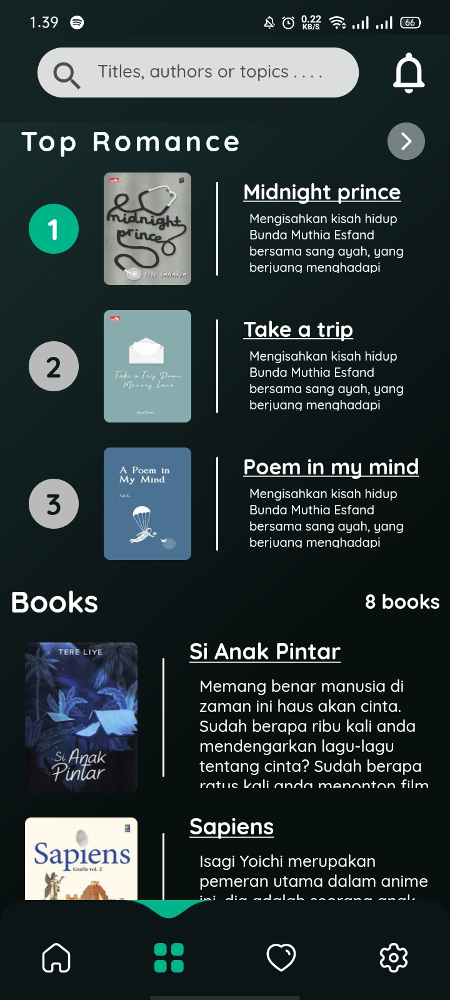
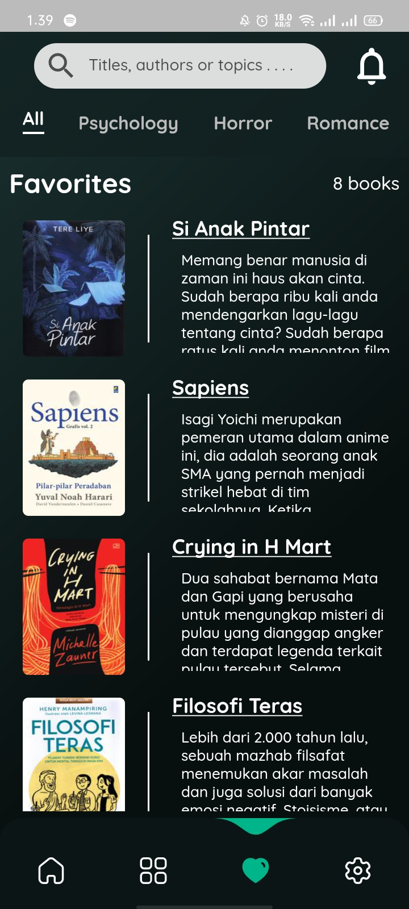
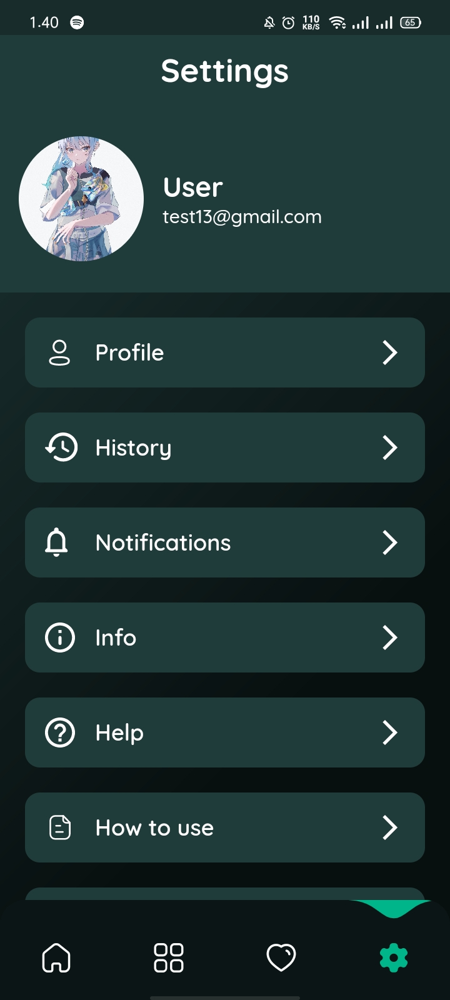

<a name="readme-top"></a>


<div align="center">

[![Contributors][contributors-shield]][contributors-url]

</div>


<!-- PROJECT LOGO -->
<br />
<div align="center">
  <a href="https://github.com/yudiyahrian/e-library">
    
  </a>

  <h3 align="center">E-Starby</h3>

  <p align="center">
    An Library app built using Flutter and Firebase
    <br />
    <a href="https://github.com/yudiyahrian/e-library"><strong>Explore the docs »</strong></a>
    <br />
    <br />
    <!-- <a href="https://github.com/yudiyahrian/e-library">View Demo</a> -->
    ·
    <a href="https://github.com/yudiyahrian/e-library/issues">Report Bug</a>
    ·
    <a href="https://github.com/yudiyahrian/e-library/issues">Request Feature</a>
  </p>
</div>


<!-- TABLE OF CONTENTS -->
<details>
  <summary>Table of Contents</summary>
  <ol>
    <li>
      <a href="#about-the-project">About The Project</a>
      <ul>
        <li><a href="#built-with">Built With</a></li>
        <li><a href="#images">Images</a></li>
      </ul>
    </li>
    <li>
      <a href="#getting-started">Getting Started</a>
      <ul>
        <li><a href="#prerequisites">Prerequisites</a></li>
        <li><a href="#installation">Installation</a></li>
      </ul>
    </li>
    <li><a href="#usage">Usage</a></li>
    <li><a href="#roadmap">Roadmap</a></li>
    <li><a href="#contributing">Contributing</a></li>
    <li><a href="#license">License</a></li>
    <li><a href="#contact">Contact</a></li>
    <li><a href="#acknowledgments">Acknowledgments</a></li>
  </ol>
</details>


<!-- ABOUT THE PROJECT -->
## About The Project

<div align="center">
    
    
</div>

E-Starby is a library-based application
mobile with login, register, etc. features. E-Starby created
using Flutter and Firebase as Database.

This project was created by 7 students from SMK Taruna Bhakti
* [Yudiya Ahrian](https://github.com/yudiyahrian)
* [Ibrahim Khalis](https://github.com/IbrahimKhalis)
* [Rasya Fadil Arfiano](https://github.com/Rasya09)
* [Aryo Syawalito Bimo](https://github.com/AryoSyawal)
* [Riski Aditya N](https://github.com/rizky2016)
* [Ahmad Miftah](https://github.com/ahmadmiftah2006)
* [Dimas Adriyanto](https://github.com/DimasMids444)

Maybe not all of the names above contributed to the creation of this application, but this project is a task given by our school and has many other tasks such as making a project report, Power Point for presentations, etc. So all the names above work well in each task that has been given 

<p align="right">(<a href="#readme-top">back to top</a>)</p>


### Built With

This project is built using the powerful Dart framework, Flutter, and features an advanced authentication system and database powered by Firebase.

* [![Flutter][Flutter]][Flutter-url]
* [![Firebase][Firebase]][Firebase-url]
* [![Figma][Figma]][Figma-url]

<p align="right">(<a href="#readme-top">back to top</a>)</p>

### Images
<div align="center">
    
    
    
    
    
    
</div>

<p align="right">(<a href="#readme-top">back to top</a>)</p>

<!-- GETTING STARTED -->
## Getting Started

This section provides instructions on how to set up and run the Flutter project locally. Follow these simple steps to get a local copy up and running:

### Prerequisites

This is a Flutter project, and you'll need to have Flutter SDK installed along with some basic prerequisites before you can run the app.

* Flutter SDK: Follow the installation guide for Flutter at https://flutter.dev/docs/get-started/install.

### Installation

_Below is an example of how you can instruct your audience on installing and setting up your app. This template doesn't rely on any external dependencies or services._

1. Fork this repository
2. Clone the repo
   ```sh
   git clone https://github.com/your_username_/Project-Name.git
   ```
3. Change directory to the project folder:
   ```sh
   cd Project-Name
   ```
4. Install the required Flutter packages:
   ```sh
   flutter pub get
   ```

### Run the app

After completing the installation, you can now run the app on your connected device or emulator:
   ```sh
   flutter run
   ```

<p align="right">(<a href="#readme-top">back to top</a>)</p>


<!-- USAGE EXAMPLES -->
## Usage

This project is already integrated with my own Firebase account. If you want to use your own Firebase account, please refer to the [Firebase Documentation](https://firebase.google.com/docs/android/setup) for detailed instructions on how to set it up.

<p align="right">(<a href="#readme-top">back to top</a>)</p>


<!-- ROADMAP -->
## Roadmap

- [x] Create a job desk for each member
- [x] Create a design on Figma
- [x] Slicing design from Figma into Flutter
- [x] Integrate project with Firebase
- [ ] Theme support
    - [ ] Light
    - [x] Dark

See the [open issues](https://github.com/yudiyahrian/e-library/issues) for a full list of proposed features (and known issues).

<p align="right">(<a href="#readme-top">back to top</a>)</p>


<!-- CONTACT -->
## Contact

Yudiya Ahrian - [@yudiyahrian](https://instagram.com/yudiyahrian) - yudiyaahrian@gmail.com

Project Link: [https://github.com/yudiyahrian/e-library](https://github.com/yudiyahrian/e-library)

<p align="right">(<a href="#readme-top">back to top</a>)</p>


<!-- ACKNOWLEDGMENTS -->
## Acknowledgments

In this section, we'd like to acknowledge and give credit to the following resources that have been instrumental in the development of this project. These resources provided valuable guidance, inspiration, and knowledge.

* [Flutter](https://flutter.dev/)
* [Firebase](https://firebase.google.com/)
* [Figma](https://www.figma.com/)
* [Pub Dev](https://pub.dev)
* [Dribble](https://dribbble.com/shots)
* [Trello](https://trello.com/)
* [Img Shields](https://shields.io)
* [GitHub Pages](https://pages.github.com)

I am grateful to these resources for their contribution to this project and helping us grow as a developer.

<p align="right">(<a href="#readme-top">back to top</a>)</p>


<!-- MARKDOWN LINKS & IMAGES -->
<!-- https://www.markdownguide.org/basic-syntax/#reference-style-links -->
[contributors-shield]: https://img.shields.io/github/contributors/yudiyahrian/e-library.svg?style=for-the-badge
[contributors-url]: https://github.com/yudiyahrian/e-library/graphs/contributors
[Flutter]: https://img.shields.io/badge/flutter-000000?style=for-the-badge&logo=flutter&logoColor=blue
[Flutter-url]: https://flutter.dev/
[Figma]: https://img.shields.io/badge/figma-000000?style=for-the-badge&logo=figma
[Figma-url]: https://www.figma.com/
[Firebase]: https://img.shields.io/badge/firebase-20232A?style=for-the-badge&logo=firebase
[Firebase-url]: https://firebase.google.com/
